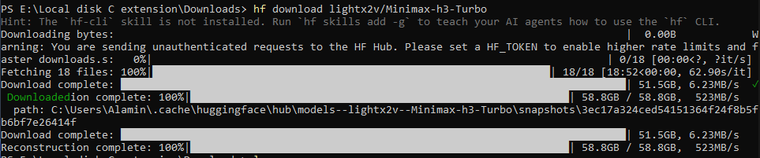

## Downloading model from HuggingFace 

**Method 1 (better):** 

*Cloning repo*: Running commands such as: `git clone https://huggingface.co/Qwen/QwenXX-XX` 

However, this method does not show the download progress bar. but you get direct access to the model files, unlike downloading using hf.


**Method 2:**

*Downloading using hf*:

	> Install git-xet: `winget install git-xet` #needed only the first time for Windows

	> Install huggingface:  `pip install huggingface\_hub` #needed only first time
	> Download model: `hf download lightx2v/XXXX-XXX-XXX` #may need to disable smart app control for windows.

	>The model will be downloaded in the root directory for Windows, such as "C:\\Users\\Alamin\\.cache\\huggingface\\hub\\"

<p align="center">
    
</p>

##  The following is for Banana Pi M1 1GB 

The following shows how to download, set up, and run Ollama models from Hugging Face. The 32-bit system is for Banana Pi, and the other systems also follow a similar pattern.

The downloaded file is in .gguf format so the model can be run directly from terminal without any python script.


*Linux (32-bit armv7l):*

1) Install llama.cpp in a new directory (since full llama is not supported on Banana Pi)
	`git clone https://github.com/ggerganov/llama.cpp`
2) Make sure a C++ compiler is installed
	`apt install -y build-essential cmake`
3) Go to the llama.cpp directory and build llama.cpp. -j2 means use 2 cores.
	`cmake --build build -j2`
	''if cmake is not installed: sudo apt install cmake -y''
4) After a long wait of build check the files and look for "llama-cli" under "ls build/bin/"
	`cd /build/bin`
5) Download a model from https://huggingface.co/ select a model and copy its Download link. save on a directory on the Linux device.
	`wget https://huggingface.co/unsloth/DeepSeek-R1-Distill-Qwen-1.5B-GGUF/resolve/main/DeepSeek-R1-Distill-Qwen-1.5B-Q2\_K.gguf`

6) Make sure enough space is available
	`free -h`
	`swapon --show`
7) Finally, run the model.
	 `\~/Myfolder/Ollamatest/llama.cpp/build/bin/llama-cli -m \~/Myfolder/Ollamatest/deepseekModels/DeepSeek-R1-Distill-Qwen-1.5B-Q2\_K.gguf -p "Explain what an embedded system is in simple terms." -n 64 --ctx-size 256 --threads 2 --batch-size 16 --no-mmap`


### Notes:
```
What each flag means when running the downloaded model:

ctx-size 256 → saves RAM
batch-size 16 → avoids memory spikes
no-mmap → prevents filesystem crashes on low RAM
n 64 → limits output tokens
threads 2 → matches Banana Pi cores 2)
```


##  The following is for the Orange Pi 5 plus 16GB 

### Note: the following is useful if the downloaded model does not have a .gguf file. In that case, a Python script is very useful.

**This is a 64-bit board with 8-core processors. Contains on-board 16GB RAM along with a 6 TOPS NPU:**

1)	Install llama.cpp as a new directory (since full llama is not supported on bananapi)
	`git clone https://github.com/ggerganov/llama.cpp`
2)	Move to the llama directory: 
	`cd llama.cpp`
3)	Configure for ARM optimization so that it utilizes hardware vector extensions and dot product:

	```
	cmake -B build \\
	-DCMAKE\_BUILD\_TYPE=Release \\
	-DCMAKE\_C\_FLAGS="-march=armv8.2-a+dotprod+fp16fml" \\
	-DCMAKE\_CXX\_FLAGS="-march=armv8.2-a+dotprod+fp16fml"
	```
4)	Run the build on 8 threads; this may take some time:
	`cmake --build build --config Release -j8`
5)	Download the model from Hugging Face by cloning the repo: `git clone https://huggingface.co/Qwen/Qwen3-4B`

6)	Ensure you have the following installed:
	`python3 --version`	//must be 3.10+
	`pip show torch`	//must be 2.6.x or newer
	`pip show transformers`	//must be 4.51.x or newer
	`pip show tokenizers`	//must be installed the latest
	`python3 -m pip --version` //must be setup
7)	Create a Python script to run the model:

```
import torch
from transformers import (
AutoTokenizer,
AutoModelForCausalLM,
TextStreamer
)

MODEL\_PATH = "/home/alaminorange/Downloads/Qwen3-0.6B"

print("Loading tokenizer...")
tokenizer = AutoTokenizer.from\_pretrained(MODEL\_PATH)

print("Loading model...")
model = AutoModelForCausalLM.from\_pretrained(
   MODEL\_PATH,
   torch\_dtype="auto"
)

model.to("cpu")
model.eval()

print("\\nModel loaded!")
print("Type 'exit' to quit.\\n")

while True:
   prompt = input("You: ")
   if prompt.lower() in \["exit", "quit"]:
       break
   messages = \[
       {"role": "user", "content": prompt}
   ]
   text = tokenizer.apply\_chat\_template(
       messages,
       tokenize=False,
       add\_generation\_prompt=True,
       enable\_thinking=False
   )
   inputs = tokenizer(
       \[text],
       return\_tensors="pt"
   )
   print("Qwen: ", end="", flush=True)
   streamer = TextStreamer(
       tokenizer,
       skip\_prompt=True,
       skip\_special\_tokens=True
   )
   with torch.no\_grad():
       model.generate(
           \*\*inputs,
           streamer=streamer,
           max\_new\_tokens=256,
           temperature=0.7,
           top\_p=0.8,
           top\_k=20
       )
   print("\\n")
```

8) Run the python script and the chatbot should start running.


### Note: The following works if the model contains .gguf file

<br>
<br>

## Troubleshooting: 

 Upgrade pillow if you get error like 'Could not import module 'Qwen3ForCausalLM'' by: python3 -m pip install --user --upgrade Pillow


